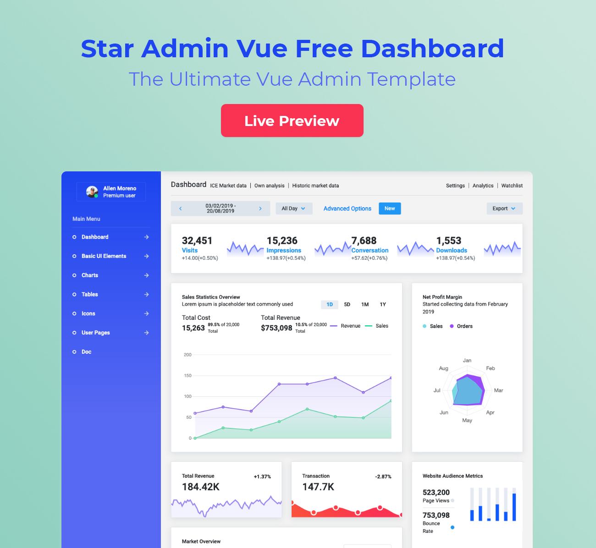

# Star Admin Free Vue Admin Template


Star Admin Vue Admin Template is a free admin template based on Bootstrap 4 and Vue.js. The template is built using the framework Bootstrap-Vue. Bootstrap-Vue is a framework that implements the Bootstrap 4 components and grid system available for Vue.js.

Star Admin Free Vue Admin Template is a completely responsive and mobile-first admin template that provides a great foundation for your Bootstrap + Vue.js project.

This remarkably flexible and highly customizable template helps you create an amazing UI for your admin panel.

## Demo

Visit: https://www.bootstrapdash.com/demo/star-admin-vue/

[](http://www.bootstrapdash.com/demo/star-admin-vue)

## Installation

### What's included

Within the download you'll find the following directories and files, logically grouping common assets and providing both compiled and minified variations. You'll see something like this:

```
StarAdmin-Free-Vue-Admin-Template/
├── source/
├── static/
├── index.html
├── README.md
├── screenshot.jpg

```

### Usage

``` bash
# clone the repo
$ git clone https://github.com/BootstrapDash/StarAdmin-Free-Vue-Admin-Template.git

# go into app's directory
$ cd StarAdmin-Free-Vue-Admin-Template/source/

# install dependencies
npm install

# serve with hot reload at localhost:8080
npm run dev

# build for production with minification
npm run build
```


### Advanced Options

``` bash
# build for production and view the bundle analyzer report
npm run build --report

# run unit tests
npm run unit

# run e2e tests
npm run e2e

# run all tests
npm test
```

For a detailed explanation on how things work, check out the [guide](http://vuejs-templates.github.io/webpack/) and [docs for vue-loader](http://vuejs.github.io/vue-loader).
